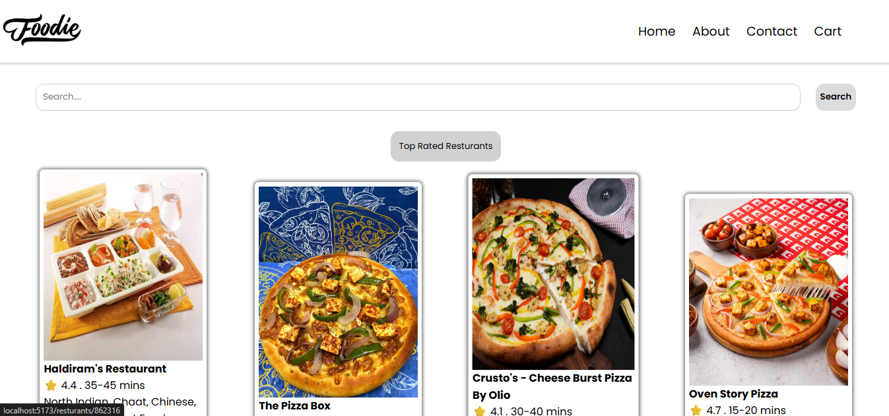
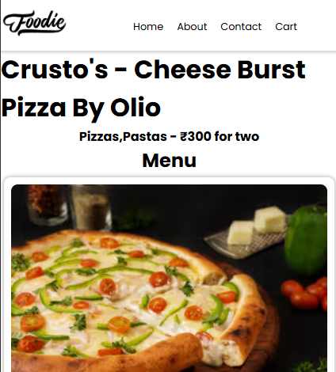
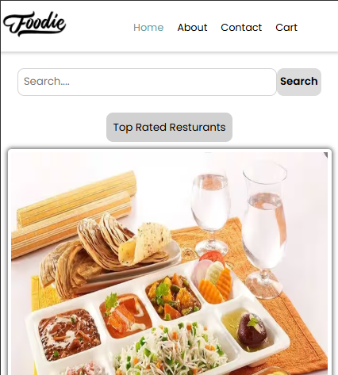
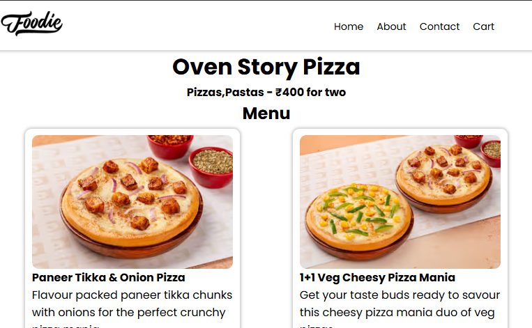
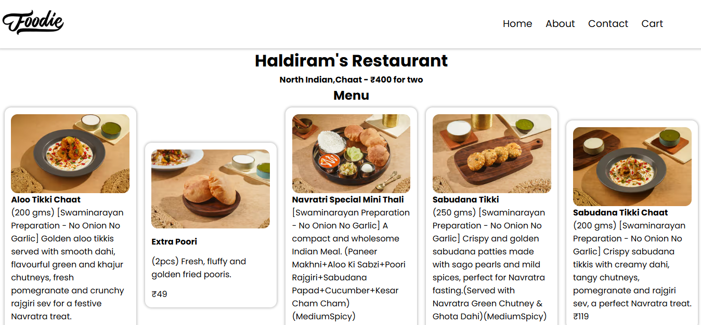

# 🍴 Foodie — React + Vite App

A responsive restaurant listing and menu web app that fetches live restaurant data from **Swiggy’s public API**, processes complex nested data, and displays dynamic menus. Users can search and filter restaurants and navigate seamlessly using React Router. Built with functional components, React Hooks, and reusable UI components. Fully optimized for mobile, tablet, and desktop with a clean, modern design.

---

## ✨ Features
- Fetches and displays live restaurant data.
- **Search functionality**: quickly find restaurants by name.
- **Filter functionality**: toggle to view only top-rated restaurants.
- **Dynamic routing** using `react-router-dom`:
  - Home page → list of restaurants.
  - Click on a restaurant → navigate to its menu page.
- Built with **React Hooks** (`useState`, `useEffect`) for state management.
- **Reusable components**: header, footer, restaurant cards, menu sections.
- **Fully responsive design**: optimized for mobile, tablet, and desktop.
- Clean UI with modern styling.

---

## 🖼️ Screenshots

### Home Page


### Restaurant Menu


### Responsive Design




---

## 🧰 Tech Stack
- **React** (functional components + hooks)
- **Vite** (development environment)
- **React Router DOM** (routing & dynamic routes)
- **CSS** (responsive layouts & styling)

---

## 📂 Project Structure

```plaintext

Foodie-React-Vite-App/
│
├── images/                   # Screenshots and app images (logos, previews)
├── public/                   # Static files that don't go through the build process (favicon, etc.)
│
├── src/                      # Main application source code
│   ├── assets/               # Static assets like icons, backgrounds, etc. used within the app
│   ├── components/           # Reusable React components (e.g., Header, Footer, RestCard)
│   ├── utils/                # Helper functions and constants (e.g., API endpoints)
│   │
│   ├── App.css               # App-wide styles
│   ├── App.jsx               # Root component rendering routes and layout
│   └── main.jsx              # Entry point that renders <App /> to the DOM
│
├── .gitignore                # Specifies which files/folders Git should ignore
├── eslint.config.js          # ESLint configuration for maintaining code quality
├── index.html                # HTML template used by Vite
├── package-lock.json         # Auto-generated file for locking dependency versions
├── package.json              # Project metadata, scripts, and dependencies
├── README.md                 # Project documentation (what you're reading now)
└── vite.config.js            # Vite configuration (base path, plugins, etc.)

```

---

## 📌 Author

Made with ❤️ by [Kaustubh Dalvi](https://github.com/Kaustubh-Dalvi1001)

---

## 📬 Connect with Me

- [LinkedIn](https://www.linkedin.com/in/kaustubh-dalvi-0431662a8)  
- [GitHub](https://github.com/Kaustubh-Dalvi1001)  
- 📧 kaustubhdalvi1002@gmail.com

---

## ⭐ Show your support

If you like this project, please consider giving it a ⭐ on [GitHub](https://github.com/Kaustubh-Dalvi1001/foodie-react-vite-app)!